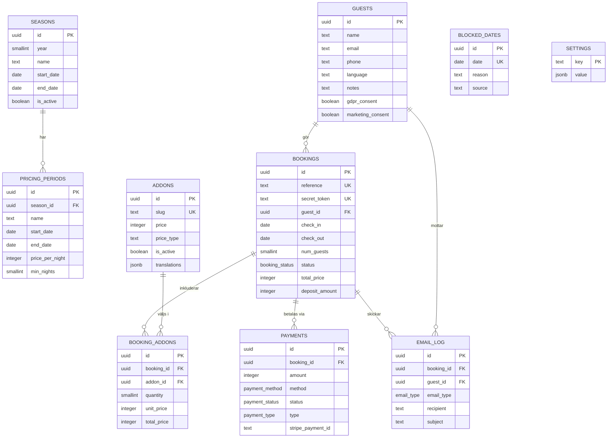

# Databasschema — Bokningssystem Vilhelmina Lodge

> Version 1.0 | 2026-04-07 | Supabase (PostgreSQL)

---

## ER-diagram



## Tabellöversikt

| Tabell | Syfte | Fas |
|--------|-------|-----|
| **seasons** | Definierar säsonger (maj–sep) med öppning/stängning | 1 |
| **pricing_periods** | Prissättning per period inom en säsong | 1 (enkel), 3 (avancerad) |
| **blocked_dates** | Blockerade datum — admin, Airbnb-synk, underhåll | 1 |
| **addons** | Tillval: båt, guide, sänglinne, städ | 1 |
| **guests** | Gästregister med kontaktuppgifter och språk | 1 |
| **bookings** | Alla bokningar — från förfrågan till genomförd | 1 |
| **booking_addons** | Kopplingstabell: vilka tillval en bokning inkluderar | 1 |
| **payments** | Betalningar via Stripe (fas 1) och Swish (fas 2) | 1 |
| **email_log** | Logg över all e-postkommunikation | 1 |
| **settings** | Globala inställningar (depositionsbelopp, max gäster etc.) | 1 |

## Bokningsflöde i databasen

```
1. Gäst fyller i formulär
   → INSERT guests (om ny gäst)
   → INSERT bookings (status: 'pending')
   → INSERT booking_addons (tillval)
   → INSERT email_log (booking_received)

2. Admin granskar och godkänner
   → UPDATE bookings (status: 'confirmed', confirmed_at)
   → INSERT email_log (booking_confirmed + payment_request)

3. Gäst betalar deposition
   → INSERT payments (method: 'stripe', type: 'deposit')
   → UPDATE bookings (status: 'paid', paid_at)
   → INSERT email_log (payment_confirmed)

4. Före vistelse
   → INSERT email_log (reminder + welcome)

5. Efter vistelse
   → UPDATE bookings (status: 'completed')
```

## Nyckelval

**Flerspråkighet i addons:** JSONB-fält med `{ "en": {...}, "sv": {...} }` — flexibelt och kräver inga extra tabeller.

**Priser sparas på bokningen:** `lodge_total`, `addons_total` och `total_price` sparas vid bokningstillfället så priset inte ändras i efterhand.

**Bokningsreferens:** Auto-genereras som `VL-2026-001` via en trigger — lätt att kommunicera med gäster.

**Secret token:** Varje bokning får ett unikt `secret_token` (32 hex-tecken) som skickas i bekräftelsemejlet. Gästen kan se sin bokning via en länk med token — utan att behöva logga in. RLS-policyn kräver antingen rätt token eller admin-inloggning.

**GDPR-samtycke:** Gästtabellen spårar `gdpr_consent` (obligatoriskt) och `marketing_consent` (valfritt) med tidsstämpel.

**Row Level Security:** Gäster (anon) kan se tillgänglighet och skapa bokningar. Bokningsdetaljer kräver secret_token eller admin-inloggning via Supabase Auth.

## Standardinställningar

| Nyckel | Värde |
|--------|-------|
| deposit_amount | 5000 SEK |
| max_guests | 8 |
| currency | SEK |
| booking_auto_decline_hours | 72 |
| supported_languages | en, sv, de, fr |
